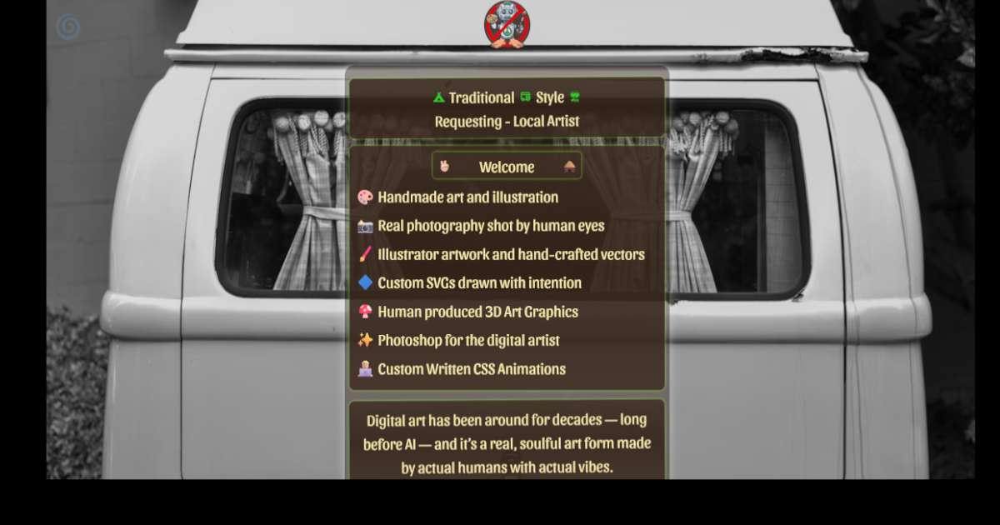

## 🌼 What This Project Is For — Non‑Robot Art

The **Non‑Robot Art** page exists to explain one simple thing:

### **This website supports real, human-made art — not AI-generated art.**
### https://ai.brainbuddys.com
Many artists today feel drowned out by machine-made images. This project creates a safe, friendly “No‑Robot Zone” where handmade creativity is respected, celebrated, and protected.

The purpose of this page is to:

- 🌿 **Show visitors that all artwork on this site is created by real humans**, not robots or AI models.  
- 🧶 **Support local artists** who rely on their craft, skill, and imagination.  
- 🎨 **Explain the difference between digital art and AI art** in a way that’s easy to understand.  
- ✌️ **Keep the vibe fun, simple, and hippie-friendly**, with moving objects, playful animations, and visuals that keep wandering minds entertained.  
- 🔥 **Make it clear that this site honors handmade creativity**, whether it’s painting, crochet, illustration, photography, or any other craft.

This page is the official statement of the site’s values:  
**Human art matters. Local artists matter. Creativity matters. Robots don’t run this place.**

## 🐂 Credits  
Created by **Brett's Custom  Hybrid Web Development**  
  High‑Vibe Creative Director
  

  

  
## Fonts used
*   Sansita-Italic
*   Itim-Regular.ttf
*    
*  